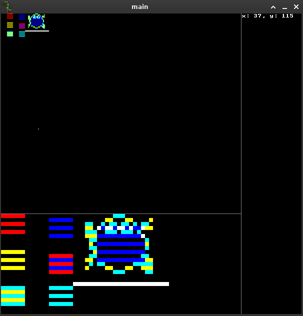

# oricDraw
Pixel paint program for drawing with Oric HIRES mode limitations
- i to invert
- ctrl+l to load
- ctrl+s to save HRS (hires screen with tape header)
- ctrl+shift+s to save animated sprite as C header file (starts in the topleft corner of the screen)

    
